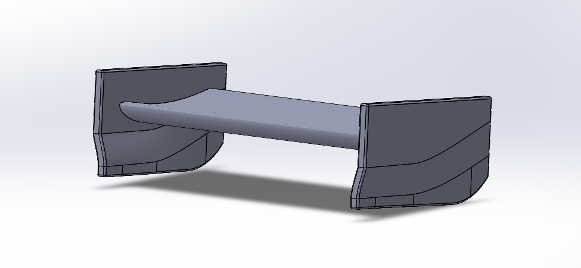
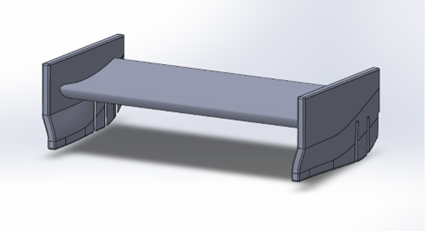
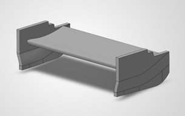
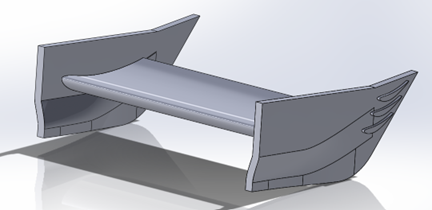
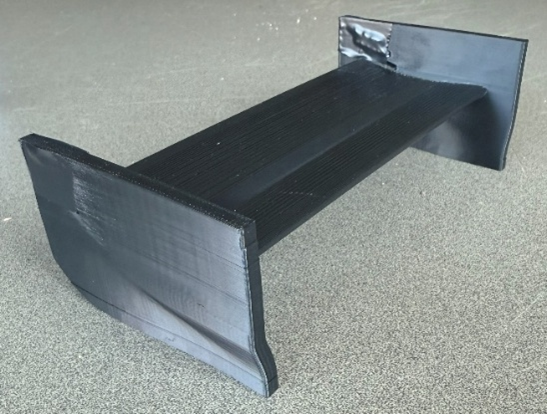
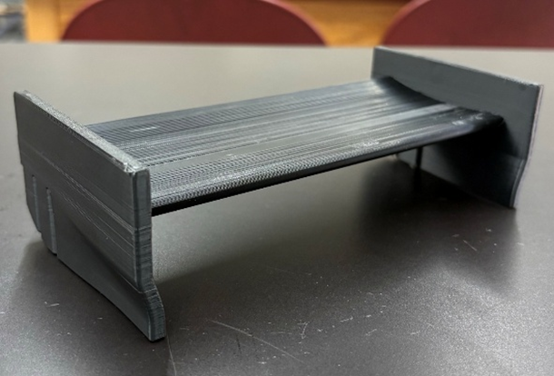
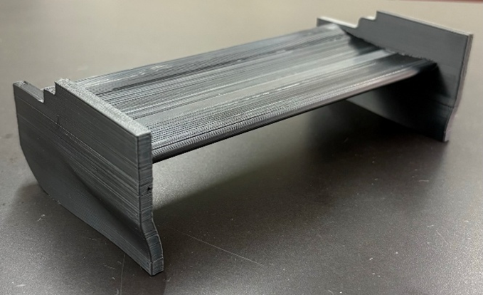
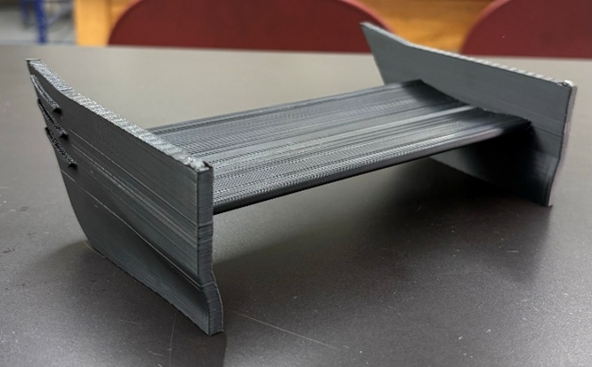

# Rear-Wing Aerodynamics — CFD & Wind Tunnel Analysis

Computational and experimental investigation of rear-wing endplate geometries and their effects on downforce, drag, aerodynamic efficiency, and wingtip vortex behavior.

## Project Overview

### My Role
Project Lead — Concept Development, CAD Design, CFD Analysis, Prototype Manufacturing, and Experimental Testing

I originated the project concept and served as team lead throughout its development, coordinating the overall design, simulation, manufacturing, and experimental testing process. In addition to overseeing the project direction, I contributed across each phase of the engineering workflow as needed.

### Project Type
Collaborative Aerodynamics Research

### Tools
SolidWorks | SolidWorks Flow Simulation | Additive Manufacturing | Wind Tunnel Testing

### Focus Areas
Computational Fluid Dynamics | Aerodynamics | Experimental Validation | Rapid Prototyping

### Configurations Investigated
Reference Endplate | Slats | Cutouts | Strakes

## The Challenge

Rear wings generate downforce to improve vehicle stability and tire loading at high speeds, but the pressure difference across the wing also produces wingtip vortices that contribute to induced drag.

This project investigated whether modifications to rear-wing endplate geometry could manipulate these flow structures to improve aerodynamic performance while maintaining or increasing downforce.

## Endplate Design Concepts

Four rear-wing configurations were developed and evaluated to investigate how endplate geometry influences aerodynamic performance and wingtip flow behavior.

### Reference Endplate

The reference configuration used a conventional solid endplate and served as the baseline for comparing the aerodynamic effects of the modified designs.

### Slatted Endplate

The slatted configuration incorporated angled aerodynamic elements intended to redirect airflow near the wingtip and influence the interaction between the rear wing and surrounding flow.

### Cutout Endplate

The cutout configuration removed selected areas of the endplate to investigate how allowing additional cross-flow between the high- and low-pressure regions affected downforce, drag, and wingtip behavior.

### Straked Endplate

The straked configuration incorporated additional flow-control surfaces intended to redirect airflow near the wingtip and modify local flow structures.
<table>
  <tr>
    <td align="center">
       
      <b>Reference Endplate</b>
    </td>
    <td align="center">
       
      <b>Slatted Endplate</b>
    </td>
  </tr>
  <tr>
    <td align="center">
       
      <b>Cutout Endplate</b>
    </td>
    <td align="center">
       
      <b>Straked Endplate</b>
    </td>
  </tr>
</table>

## Prototype Manufacturing

Each rear-wing configuration was fabricated using additive manufacturing to create physical models for experimental wind-tunnel testing. The same wing geometry was maintained across the four prototypes while the endplate design was varied, allowing the aerodynamic effects of each configuration to be compared under consistent test conditions.

<table>
  <tr>
    <td align="center">
       
      <b>Reference Prototype</b>
    </td>
    <td align="center">
       
      <b>Slatted Prototype</b>
    </td>
  </tr>
  <tr>
    <td align="center">
       
      <b>Cutout Prototype</b>
    </td>
    <td align="center">
       
      <b>Straked Prototype</b>
    </td>
  </tr>
</table>

## CFD Analysis

Computational fluid dynamics simulations were performed using SolidWorks Flow Simulation to evaluate the aerodynamic behavior of each rear-wing configuration prior to experimental testing.

The reference, slatted, cutout, and straked configurations were analyzed at **0°, 10°, and 15° angles of attack** under consistent external-flow conditions. The computational domain was based on the dimensions of the wind tunnel used for experimental testing, with an inlet velocity of **98.4 ft/s**. Surface roughness was also incorporated to better represent the 3D-printed prototypes.

### Simulation Approach

The CFD analysis evaluated:

- Lift and drag forces
- Pressure distribution across the wing
- Velocity trajectories and wake behavior
- Wingtip vortex development
- Solution convergence

Mesh refinement was applied to each configuration, with approximately **1.6–2.1 million fluid cells** depending on geometry. The slatted configuration required additional cells to resolve airflow through the more complex endplate features.

All simulations demonstrated convergence, allowing the aerodynamic behavior of the four configurations to be compared across the three angles of attack.

### Velocity Flow Comparison — 10° Angle of Attack

<table>
  <tr>
    <td align="center">
       
      <b>Reference</b>
    </td>
    <td align="center">
       
      <b>Slatted</b>
    </td>
  </tr>
  <tr>
    <td align="center">
       
      <b>Cutout</b>
    </td>
    <td align="center">
       
      <b>Straked</b>
    </td>
  </tr>
</table>

The velocity trajectories demonstrate how relatively small changes in endplate geometry altered the wingtip and wake flow structures. The reference geometry developed conventional wingtip vortices, while the modified configurations redirected the flow through different mechanisms. The slatted configuration produced a more organized wake structure and achieved its highest aerodynamic efficiency at 10° angle of attack.

### Pressure Distribution Comparison — 15° Angle of Attack

<table>
  <tr>
    <td align="center">
       
      <b>Reference</b>
    </td>
    <td align="center">
       
      <b>Slatted</b>
    </td>
  </tr>
  <tr>
    <td align="center">
       
      <b>Cutout</b>
    </td>
    <td align="center">
       
      <b>Straked</b>
    </td>
  </tr>
</table>

Increasing the angle of attack strengthened the pressure differential across the rear wing, with higher-pressure regions developing along the upper surface and lower-pressure regions beneath the airfoil. At 15°, these pressure differences were most pronounced, corresponding with the increased downforce generated by each configuration.
