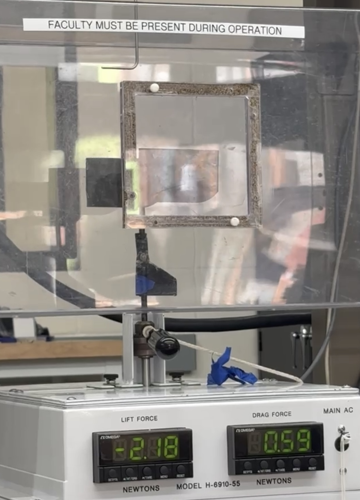
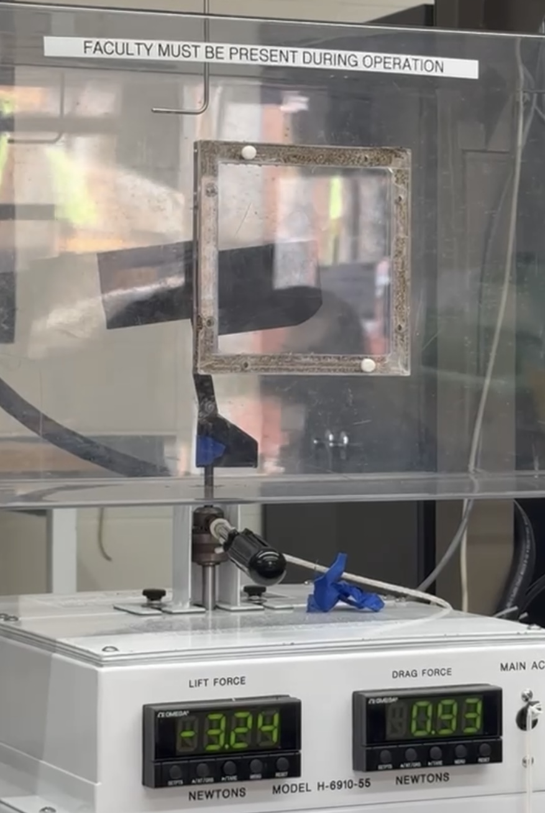
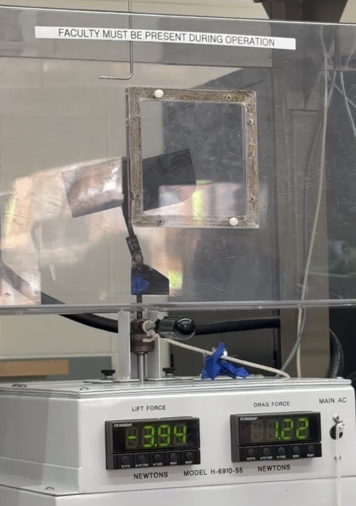
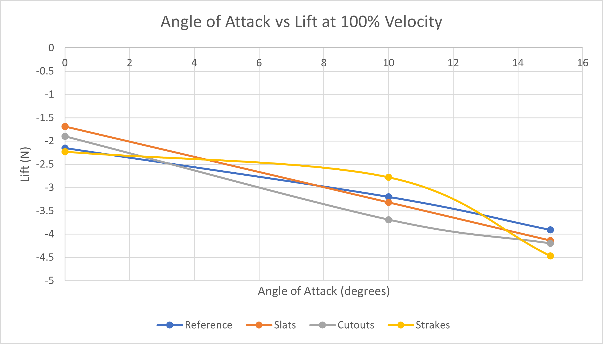
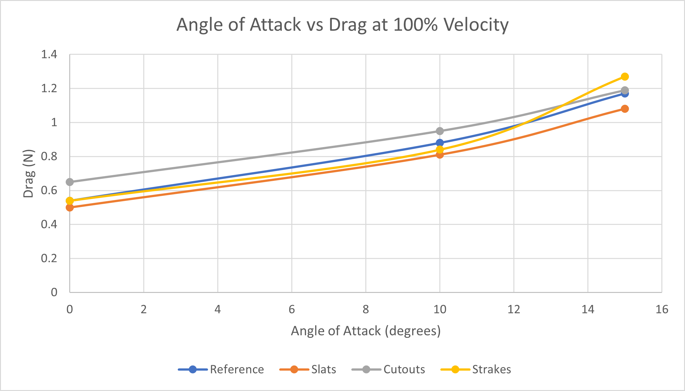
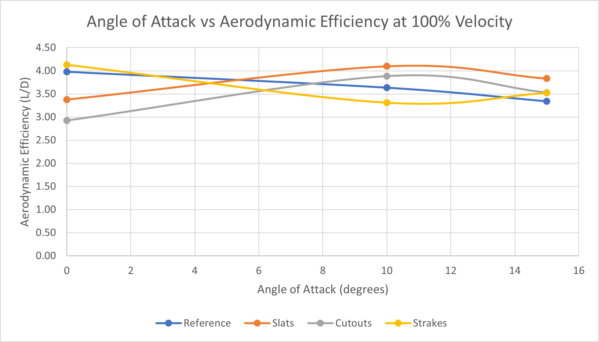
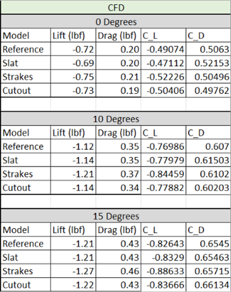

# Rear-Wing Aerodynamics — CFD & Wind Tunnel Analysis

Computational and experimental investigation of rear-wing endplate geometries and their effects on downforce, drag, aerodynamic efficiency, and wingtip vortex behavior.

## Project Overview

### My Role
Project Lead — Concept Development, CAD Design, CFD Analysis, Prototype Manufacturing, and Experimental Testing

I originated the project concept and served as team lead throughout its development, coordinating the overall design, simulation, manufacturing, and experimental testing process. In addition to overseeing the project direction, I contributed across each phase of the engineering workflow as needed.

### Project Type
Collaborative Aerodynamics Research

### Tools
SolidWorks | SolidWorks Flow Simulation | Additive Manufacturing | Wind Tunnel Testing

### Focus Areas
Computational Fluid Dynamics | Aerodynamics | Experimental Testing | Rapid Prototyping

### Configurations Investigated
Reference Endplate | Slats | Cutouts | Strakes

## The Challenge

Rear wings generate downforce to improve vehicle stability and tire loading at high speeds, but the pressure difference across the wing also produces wingtip vortices that contribute to induced drag.

This project investigated whether modifications to rear-wing endplate geometry could manipulate these flow structures to improve aerodynamic performance while maintaining or increasing downforce.

## Endplate Design Concepts

Four rear-wing configurations were developed and evaluated to investigate how endplate geometry influences aerodynamic performance and wingtip flow behavior.

### Reference Endplate

The reference configuration used a conventional solid endplate and served as the baseline for comparing the aerodynamic effects of the modified designs.

### Slatted Endplate

The slatted configuration incorporated angled aerodynamic elements intended to redirect airflow near the wingtip and influence the interaction between the rear wing and surrounding flow.

### Cutout Endplate

The cutout configuration removed selected areas of the endplate to investigate how allowing additional cross-flow between the high- and low-pressure regions affected downforce, drag, and wingtip behavior.

### Straked Endplate

The straked configuration incorporated additional flow-control surfaces intended to redirect airflow near the wingtip and modify local flow structures.
<table>
  <tr>
    <td align="center">
       
      <b>Reference Endplate</b>
    </td>
    <td align="center">
       
      <b>Slatted Endplate</b>
    </td>
  </tr>
  <tr>
    <td align="center">
       
      <b>Cutout Endplate</b>
    </td>
    <td align="center">
       
      <b>Straked Endplate</b>
    </td>
  </tr>
</table>

## Prototype Manufacturing

Each rear-wing configuration was fabricated using additive manufacturing to create physical models for experimental wind-tunnel testing. The same wing geometry was maintained across the four prototypes while the endplate design was varied, allowing the aerodynamic effects of each configuration to be compared under consistent test conditions.

<table>
  <tr>
    <td align="center">
       
      <b>Reference Prototype</b>
    </td>
    <td align="center">
       
      <b>Slatted Prototype</b>
    </td>
  </tr>
  <tr>
    <td align="center">
       
      <b>Cutout Prototype</b>
    </td>
    <td align="center">
       
      <b>Straked Prototype</b>
    </td>
  </tr>
</table>

## CFD Analysis

Computational fluid dynamics simulations were performed using SolidWorks Flow Simulation to evaluate the aerodynamic behavior of each rear-wing configuration prior to experimental testing.

The reference, slatted, cutout, and straked configurations were analyzed at **0°, 10°, and 15° angles of attack** under consistent external-flow conditions. The computational domain was based on the dimensions of the wind tunnel used for experimental testing, with an inlet velocity of **98.4 ft/s**. Surface roughness was also incorporated to better represent the 3D-printed prototypes.

### Simulation Approach

The CFD analysis evaluated:

- Lift and drag forces
- Pressure distribution across the wing
- Velocity trajectories and wake behavior
- Wingtip vortex development
- Solution convergence

Mesh refinement was applied to each configuration, with approximately **1.6–2.1 million fluid cells** depending on geometry. The slatted configuration required additional cells to resolve airflow through the more complex endplate features.

All simulations demonstrated convergence, allowing the aerodynamic behavior of the four configurations to be compared across the three angles of attack.

### Velocity Flow Comparison — 10° Angle of Attack

<table>
  <tr>
    <td align="center">
       
      <b>Reference</b>
    </td>
    <td align="center">
       
      <b>Slatted</b>
    </td>
  </tr>
  <tr>
    <td align="center">
       
      <b>Cutout</b>
    </td>
    <td align="center">
       
      <b>Straked</b>
    </td>
  </tr>
</table>

The modified endplate geometries produced visibly different wingtip and wake flow structures compared with the reference configuration. The slatted configuration also achieved its highest experimentally measured aerodynamic efficiency at 10° angle of attack.

### Pressure Distribution Comparison — 15° Angle of Attack

<table>
  <tr>
    <td align="center">
       
      <b>Reference</b>
    </td>
    <td align="center">
       
      <b>Slatted</b>
    </td>
  </tr>
  <tr>
    <td align="center">
       
      <b>Cutout</b>
    </td>
    <td align="center">
       
      <b>Straked</b>
    </td>
  </tr>
</table>

Increasing the angle of attack strengthened the pressure differential across the rear wing, with higher-pressure regions developing along the upper surface and lower-pressure regions beneath the airfoil. At 15°, these pressure differences were most pronounced, corresponding with the increased downforce generated by each configuration.

## Experimental Wind-Tunnel Testing

Following the CFD analysis, the 3D-printed rear-wing prototypes were experimentally tested in a wind tunnel to evaluate their aerodynamic performance under controlled airflow conditions.

Each configuration was tested at **0°, 10°, and 15° angles of attack**, matching the conditions evaluated during the CFD study. Testing was conducted at an airflow velocity of approximately **98.4 ft/s**, allowing experimental lift and drag measurements to be compared with the computational predictions.

### Experimental Setup

The rear-wing prototypes were mounted within the wind-tunnel test section and positioned at the three selected angles of attack. The same mounting arrangement and test conditions were maintained between configurations to provide a consistent basis for comparison.

<table>
  <tr>
    <td align="center">
       
      <b>0° AoA</b>
    </td>
    <td align="center">
       
      <b>10° AoA</b>
    </td>
    <td align="center">
       
      <b>15° AoA</b>
    </td>
  </tr>
</table>

The reference configuration is shown above to demonstrate the experimental setup and angle-of-attack variation used throughout testing. The same procedure was repeated for the slatted, cutout, and straked configurations.

## Experimental Results

Wind-tunnel testing showed that aerodynamic performance varied substantially with both endplate geometry and angle of attack.

### Lift and Drag

<table>
  <tr>
    <td align="center">
       
      <b>Lift / Downforce</b>
    </td>
    <td align="center">
       
      <b>Drag</b>
    </td>
  </tr>
</table>

Increasing angle of attack generally increased both downforce and drag across all four configurations. At 15°, the straked configuration generated the greatest absolute downforce at approximately **4.47 N**, while the slatted configuration generated approximately **4.14 N** of downforce with lower drag.

### Aerodynamic Efficiency

  

The slatted configuration produced the strongest overall balance between downforce and drag at the higher angles of attack. At **10°**, it achieved the highest measured aerodynamic efficiency with an L/D ratio of approximately **4.10**. At **15°**, it maintained an L/D of approximately **3.83**, while also producing greater downforce and lower drag than the reference configuration.

## CFD vs. Experimental Comparison

The CFD and wind-tunnel results showed similar overall aerodynamic trends, particularly the increase in aerodynamic loading as angle of attack increased. However, the experimental results **cannot be considered a validation of the CFD model**.

Due to limited wind-tunnel availability, only a single experimental test was conducted for each configuration and angle of attack. Without repeated trials, the repeatability and uncertainty of the experimental measurements could not be adequately quantified. Multiple runs would be required to calculate averaged force measurements, evaluate experimental variation, and provide a more reliable comparison with the CFD predictions.

Additional sources of discrepancy between the computational and experimental results included:

- Surface roughness and layer lines on the 3D-printed prototypes, which introduced aerodynamic effects that could only be approximated in the CFD model.
- The physical mounting rod and test fixture, which contributed additional aerodynamic forces but were not represented in the CFD geometry.
- Limitations associated with the aging wind-tunnel equipment and its calibration history.
- Differences between the idealized computational environment and physical testing conditions.

Therefore, the experimental testing should be considered a **preliminary comparison of aerodynamic trends rather than a formal validation of the CFD results**. Future testing with repeated trials and improved control of experimental conditions would be necessary to establish repeatability and quantitatively validate the computational model.

   
  <b>Percent difference between CFD predictions and experimental measurements.</b>

## Key Findings

The combined CFD and wind-tunnel investigation demonstrated that relatively small changes in rear-wing endplate geometry can meaningfully influence aerodynamic performance.

- **Endplate geometry affected both downforce and drag.** Each modified configuration produced different aerodynamic behavior despite maintaining the same primary wing geometry.

- **Increasing angle of attack generally increased downforce and drag.** The strongest downforce was measured at 15° angle of attack, where the straked configuration generated approximately **4.47 N** of downforce.

- **The slatted configuration provided the strongest overall aerodynamic balance at higher angles of attack.** At 10°, the slatted design achieved the highest measured aerodynamic efficiency with an L/D ratio of approximately **4.10**.

- **Maximum downforce did not necessarily correspond to maximum aerodynamic efficiency.** Although the straked configuration produced the greatest downforce at 15°, the additional drag reduced its overall efficiency relative to the slatted configuration.

- **CFD provided useful insight into pressure and flow behavior, but the experimental data were insufficient for formal validation.** Additional wind-tunnel trials would be required to establish repeatability, quantify experimental uncertainty, and determine how closely the computational model predicts physical performance.

  ## Limitations & Future Work

Several improvements could strengthen the experimental and computational investigation in future testing:

- Conduct multiple wind-tunnel trials for each configuration and angle of attack to establish repeatability and calculate averaged aerodynamic forces.
- Quantify experimental uncertainty and measurement variation across repeated trials.
- Improve prototype surface finish to reduce the aerodynamic effects of additive-manufacturing layer lines.
- Incorporate the wind-tunnel mounting hardware into the CFD model to better represent the experimental test environment.
- Perform additional mesh-independence studies and refine the computational model near the endplates and wingtip flow structures.
- Investigate additional angles of attack and endplate geometries, particularly around the **10–15° range** where the modified configurations demonstrated their strongest aerodynamic performance.

- ## Engineering Takeaways

This project provided experience carrying an engineering concept through the complete design and testing process — from initial aerodynamic theory and CAD development through CFD simulation, additive manufacturing, wind-tunnel testing, and interpretation of experimental results.

Serving as project lead also required coordinating the team's design, simulation, manufacturing, and testing efforts while making engineering decisions throughout each stage of development. The project reinforced the importance of combining computational analysis with physical testing while also recognizing the limitations and uncertainty associated with both methods.

## Acknowledgements

This project was completed collaboratively with **[Rhiana Boutot](https://www.linkedin.com/in/rhiana-boutot-2761992a3/)**, **[Alexis Reiff](https://www.linkedin.com/in/alexis-reiff-17a374330/)**, and **[Jack Rollinson](https://www.linkedin.com/in/jack-rollinson-jr44/)**, whose contributions throughout the design, simulation, manufacturing, and experimental testing process were essential to the project.

Special thanks to professor **[Haifa El-Sadi](https://www.linkedin.com/in/haifa-el-sadi-b85b3b9/)** for her guidance throughout the project and for providing access to the computational and experimental resources used to complete the CFD and wind-tunnel investigation.
